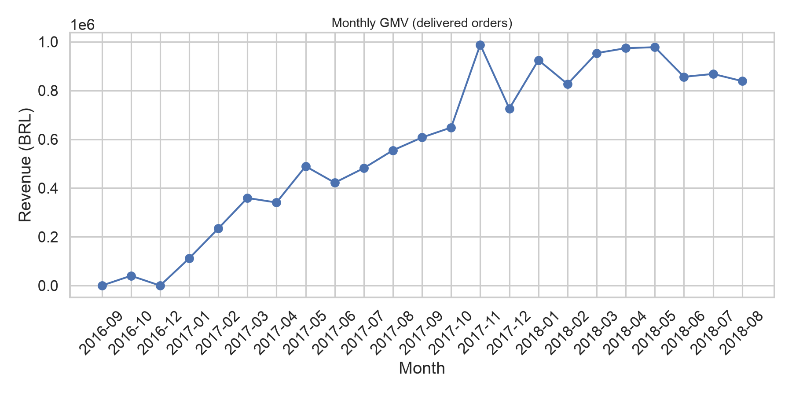

# E-commerce Analytics: продажи, клиенты и повторные покупки (Olist)

Продуктовая аналитика публичного датасета [Brazilian E-Commerce Public Dataset by Olist](https://www.kaggle.com/datasets/olistbr/brazilian-ecommerce) (~100k заказов).

**Стек:** SQL · PostgreSQL · Python (Pandas, NumPy) · Power BI

---

## Бизнес-задача

Понять:
- какие **категории** и **регионы** приносят больше выручки;
- кто является **наиболее ценным клиентом** (RFM);
- где возникают **проблемы с доставкой**;
- какие факторы связаны с **повторными покупками и удержанием**.

---

## Ключевые результаты (delivered orders)

| Метрика | Значение |
|--------|----------|
| Период | 2016-09-15 → 2018-08-29 |
| GMV | **R$ 13.22M** |
| Заказы | 96,478 |
| Клиенты | 93,358 |
| AOV | R$ 137.04 |
| Repeat purchase rate | **3.0%** |
| Средняя / медианная доставка | 12.6 / 10.2 дня |
| Late delivery rate | **8.1%** |
| M1 retention (avg по когортам) | ~0.5% |

> Полный лог выводов: [`outputs/key_findings.md`](outputs/key_findings.md)

### Визуализации

| График | Файл |
|--------|------|
| Динамика GMV |  |
| Топ категорий | `outputs/figures/top_categories.png` |
| RFM-сегменты | `outputs/figures/rfm_segments.png` |
| Retention heatmap | `outputs/figures/retention_heatmap.png` |
| Доставка | `outputs/figures/delivery_analysis.png` |

---

## Структура проекта

```
├── data/                          # CSV Olist
├── sql/
│   ├── 01_schema.sql              # Схема PostgreSQL
│   ├── 02_load_data.sql           # Загрузка CSV
│   └── 03_analytics_queries.sql   # KPI, windows, cohorts, RFM
├── scripts/run_analysis.py        # EDA + RFM + retention + exports
├── notebooks/01_olist_ecommerce_analytics.ipynb
├── outputs/                       # CSV, KPI, графики для Power BI
├── powerbi/DASHBOARD_GUIDE.md     # Как собрать дашборд (3 страницы)
└── README.md
```

---

## Быстрый старт

```bash
python3 -m venv .venv
source .venv/bin/activate
pip install -r requirements.txt

# положите CSV Olist в data/ (или скопируйте из Downloads/archive)
python scripts/run_analysis.py
```

### PostgreSQL (опционально)

```bash
psql -U postgres -f sql/01_schema.sql
# при необходимости поправьте пути в sql/02_load_data.sql
psql -U postgres -f sql/02_load_data.sql
psql -U postgres -d olist_ecommerce -f sql/03_analytics_queries.sql
```

### Power BI

1. Запустите `python scripts/run_analysis.py`
2. Импортируйте CSV из `outputs/` по инструкции [`powerbi/DASHBOARD_GUIDE.md`](powerbi/DASHBOARD_GUIDE.md)
3. Соберите 3 страницы: **Overview · Customers · Operations**

---

## Что сделано

### SQL / PostgreSQL
- схема с PK/FK и индексами;
- GMV, orders, AOV, customers;
- динамика по месяцам;
- продажи по категориям и регионам;
- `RANK()` / `DENSE_RANK()`, доля через `SUM() OVER()`;
- срок доставки и late rate;
- repeat purchases / CLV proxy;
- когортный retention;
- RFM-база через `NTILE(5)`.

### Python
- загрузка, типы, пропуски, дубликаты, выбросы (IQR);
- объединение таблиц в fact order-item;
- EDA и графики;
- RFM-сегменты: Champions, Loyal, Potential Loyalists, At Risk, Lost;
- cohort retention heatmap;
- выгрузки под Power BI.

### Power BI
- интерактивный дашборд с фильтрами по периоду, штату и RFM-сегменту (гайд в репозитории).

---

## Business Recommendations

Рекомендации основаны на фактических расчётах пайплайна (не на заранее придуманных гипотезах).

1. **Сфокусировать ассортиментную стратегию на концентрации выручки**  
   Top-5 категорий дают **~40% GMV**. Лидер — `health_beauty` (**9.3%** выручки, AOV R$ 142.6). Имеет смысл приоритизировать availability, промо и качество карточек именно в этих категориях, а не «равномерно по всему каталогу».

2. **Cross-sell между high-volume / low-AOV и high-AOV категориями**  
   У `electronics` высокий объём заказов (~2.5k), но низкий AOV (**R$ 61.6**), тогда как у `watches_gifts` AOV **R$ 212.2**. Целесообразно протестировать бандлы / рекомендации: electronics → watches_gifts / health_beauty, чтобы подтянуть средний чек без потери трафика.

3. **Операционный фокус на late delivery — прямой удар по рейтингу**  
   Late rate = **8.1%**. Средний review score при просрочке **2.57** vs **4.29** вовремя. Наибольшие late rate в штатах AL (**23.9%**), MA (**19.7%**), PI (**16.0%**). Рекомендация: пересмотреть SLA/логистических партнёров и ETA именно для проблемных штатов; это быстрее улучшит отзывы, чем общие маркетинговые акции.

4. **Win-back для At Risk вместо «широкого» retention**  
   Repeat purchase rate всего **3%**, M1 retention ~**0.5%** — для Olist это ожидаемо (преимущественно разовые покупки). При этом сегмент **At Risk** — **22.3k клиентов и ~24% выручки**, а **Champions** — только **6.9% клиентов, но 13.5% выручки**.  
   Практичнее точечные кампании: Champions — VIP/early access; At Risk — персональный win-back; Lost — низкий приоритет бюджета.

5. **Не игнорировать ценовые «выбросы» как шум**  
   IQR-выбросы по цене — **7.4%** позиций, но **~35% выручки**. Это не баги, а high-ticket товары: отдельный мониторинг наличия, фрода и доставки для дорогих заказов.

6. **Региональная концентрация = риск и возможность**  
   SP даёт **~38%** выручки. Имеет смысл отдельно моделировать рост в SP (удержание/частота) и expansion в штаты с растущим спросом, но только после выравнивания качества доставки (см. п.3).

---

## Формулировка для резюме

> E-commerce Analytics (Olist) — SQL, PostgreSQL, Python (Pandas/NumPy), Power BI.  
> Проанализировал ~100K заказов: EDA, GMV/AOV/repeat rate, RFM и когортный retention; собрал Power BI-дашборд. Выявил концентрацию выручки по категориям/регионам, влияние просроченной доставки на оценки и приоритетные сегменты для роста повторных покупок.

---

## Источник данных

Olist Brazilian E-Commerce Public Dataset (Kaggle).  
Проект учебный, пайплайн приближен к задачам junior product / data analyst в e-commerce и маркетплейсах.
