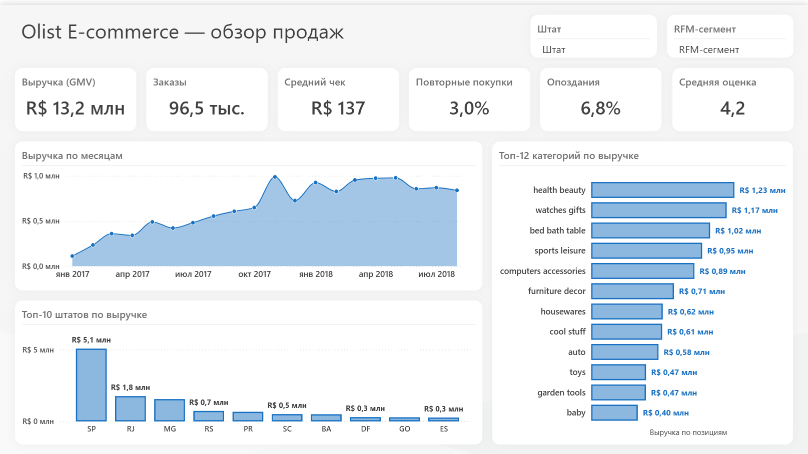
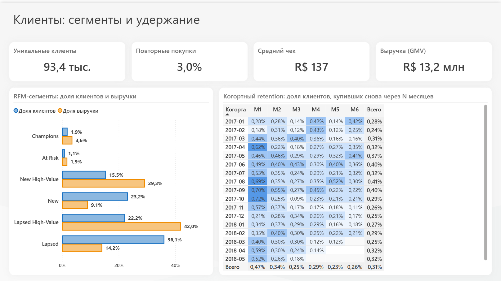
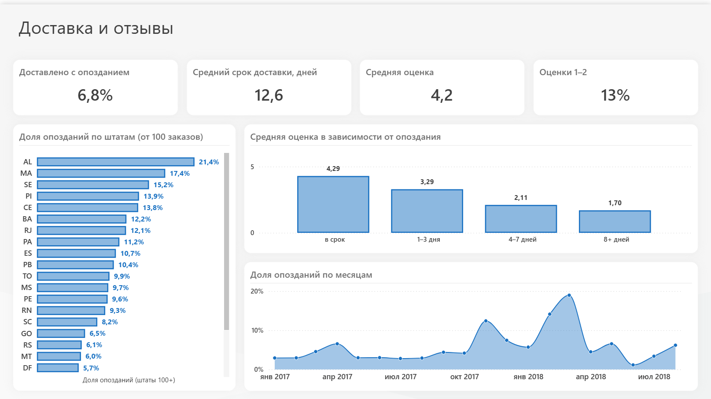
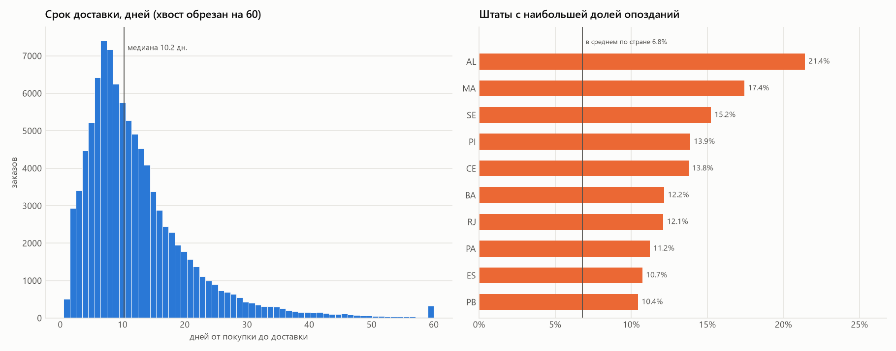
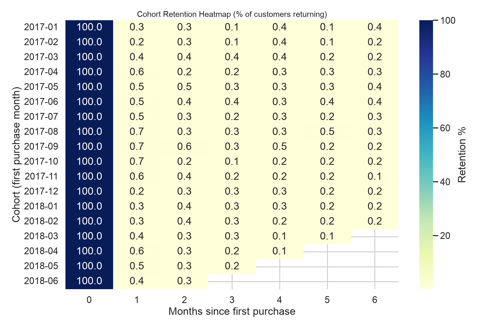

# E-commerce Analytics: продажи, клиенты и доставка (Olist)

[](https://github.com/Grustnyykater/clienpovEV/actions/workflows/tests.yml)

Аналитика бразильского маркетплейса на открытом датасете [Olist](https://www.kaggle.com/datasets/olistbr/brazilian-ecommerce): около 100 тысяч заказов с 2016 по 2018 год, 9 связанных таблиц.

**Стек:** PostgreSQL (CTE, оконные функции, когорты) · Python (pandas, NumPy, matplotlib) · Power BI (Power Query, DAX, PBIP) · pytest · Jupyter



---

## Бизнес-вопросы

1. Какие **категории** и **регионы** приносят выручку и насколько она сконцентрирована?
2. Где **проблемы с доставкой** и как они влияют на **оценки** покупателей?
3. Насколько клиенты **возвращаются** и на какие **сегменты** стоит тратить маркетинговый бюджет?

## Ключевые метрики (доставленные заказы)

| Метрика | Значение |
| --- | --- |
| Период | 2016-09-15 → 2018-08-29 |
| GMV (без доставки) | **R$ 13.22M** |
| Заказы / уникальные клиенты | 96 478 / 93 358 |
| Средний чек (AOV) | R$ 137.04 |
| Repeat purchase rate | **3.0%** |
| M1 retention (когорты 2017-01…2018-06) | 0.48% |
| Срок доставки: среднее / медиана | 12.6 / 10.2 дня |
| Доставлено позже обещанной даты | **6.8%** |
| Средняя оценка отзыва | 4.16 (вовремя 4.29 · с опозданием 2.27) |

Все цифры считаются кодом: [`outputs/kpi_summary.csv`](outputs/kpi_summary.csv), [`outputs/key_findings.md`](outputs/key_findings.md). Python, SQL и Power BI дают одинаковые результаты.

## Дашборд Power BI

Интерактивный отчёт из трёх страниц со срезами по штату и RFM-сегменту. Модель данных — 4 таблицы, связи, календарь и 17 мер DAX. Отчёт хранится в текстовом формате PBIP ([`powerbi/`](powerbi/)), поэтому изменения модели и визуалов видны в git-диффах.

| Клиенты: RFM и когортный retention | Доставка и отзывы |
| --- | --- |
|  |  |

Сводка тех же метрик на Python (matplotlib): [`outputs/figures/dashboard.png`](outputs/figures/dashboard.png).

---

## Главные выводы и рекомендации

### 1. Опоздание доставки — главный драйвер негативных отзывов

| Опоздание | Заказов | Средняя оценка | Доля оценок 1–2 |
| --- | ---: | ---: | ---: |
| в срок | 89 443 | 4.29 | 9% |
| 1–3 дня | 1 852 | 3.29 | 32% |
| 4–7 дней | 1 748 | 2.11 | 68% |
| 8+ дней | 2 781 | 1.70 | 79% |

- По **доле** опозданий хуже всего северо-восток: AL (21.4%), MA (17.4%), SE (15.2%) при среднем по стране 6.8%.
- По **количеству** опозданий главный штат — **RJ**: 12% заказов приходят с опозданием, это около 1.5 тыс. заказов, или **23% всех опозданий** при 13% заказов.
- **Рекомендация:** в первую очередь разобраться с логистикой в RJ, так как это наибольший эффект в абсолютных числах. Для северо-восточных штатов стоит закладывать в обещанную дату больший запас. Даже опоздание на 1–3 дня снижает оценку на целый балл, поэтому честный ETA дешевле ускорения доставки.



### 2. Olist — маркетплейс разовых покупок, retention здесь не главный рычаг роста

- Второй заказ сделали **3%** клиентов, а в следующем месяце возвращаются **~0.5%** когорты.
- При этом **30% «вторых заказов» оформлены в течение суток** после первого: это дозаказ или разбитая корзина, а не возвращение клиента. Реальный retention ещё ниже.
- **Рекомендация:** не делать retention главной метрикой. Рост дают привлечение и конверсия первой покупки. Из программ удержания стоит тестировать только дешёвые триггеры: медиана времени до повторной покупки — 29 дней, значит, коммуникацию нужно отправлять в первый месяц после заказа.



### 3. RFM: деньги в разовых дорогих покупателях

| Сегмент | Клиентов | Выручки |
| --- | ---: | ---: |
| Champions (2+ заказа, недавно) | 1.9% | 3.6% |
| At Risk (2+ заказа, давно) | 1.1% | 1.9% |
| New High-Value (1 заказ, недавно, топ-40% по сумме) | 15.5% | 29.3% |
| New (1 заказ, недавно) | 23.2% | 9.1% |
| Lapsed High-Value (1 заказ, давно, топ-40% по сумме) | 22.2% | **42.0%** |
| Lapsed (1 заказ, давно) | 36.1% | 14.2% |

- Повторные покупатели (Champions + At Risk) — всего 3% клиентов и 5.5% выручки, то есть классическая «лояльная база» у Olist почти отсутствует.
- **Рекомендация:** для *Lapsed High-Value* запустить win-back с персональной подборкой из той же категории. Для *New High-Value* — стимул ко второй покупке в первые 30 дней. *Lapsed* с низким чеком — минимальный бюджет. Эффект кампаний проверять через A/B-тест с контрольной группой.

### 4. Выручка сконцентрирована в нескольких категориях, штатах и дорогих товарах

- Топ-5 категорий дают **39.8%** GMV. Лидер — `health_beauty` (9.3%), следом `watches_gifts` (8.8%) с самым высоким средним чеком среди массовых категорий (R$ 212).
- На штат **SP** приходится **38%** выручки.
- Выбросы по цене (IQR, дороже R$ 276) — это **7.4% позиций, но 35% выручки**. Это не ошибки в данных, а дорогие товары, поэтому их не надо вырезать из анализа. Для них имеет смысл отдельно мониторить наличие, доставку и риск фрода.
- Рост GMV в 2017 году сменился плато в 2018-м: ~R$ 0.85–1.0M в месяц. Пик — Black Friday в ноябре 2017 года.

---

## Структура проекта

```text
├── sql/
│   ├── 01_schema.sql              # схема PostgreSQL: PK/FK, индексы
│   ├── 02_load_data.sql           # загрузка CSV через \copy
│   └── 03_analytics_queries.sql   # KPI, MoM (LAG), доли и ранги (оконные ф-ции), доставка,
│                                  # отзывы vs опоздание, repeat/CLV, когорты, RFM, оплаты
├── scripts/
│   ├── run_analysis.py            # пайплайн: CSV → метрики → выгрузки → графики
│   ├── viz.py                     # графики и сводный дашборд
│   ├── configure_powerbi.py       # путь к данным для отчёта Power BI
│   └── copy_data.sh
├── notebooks/
│   └── 01_olist_ecommerce_analytics.ipynb   # отчёт с выводами (запускает пайплайн)
├── tests/test_metrics.py          # unit-тесты логики метрик на синтетических данных
├── outputs/                       # CSV с результатами, key_findings.md, figures/
├── powerbi/
│   ├── OlistDashboard.pbip        # открыть в Power BI Desktop
│   ├── OlistDashboard.SemanticModel/  # модель (TMDL): таблицы, связи, меры DAX
│   ├── OlistDashboard.Report/     # отчёт (PBIR): страницы и визуалы
│   ├── screenshots/
│   └── DASHBOARD_GUIDE.md         # описание модели и мер
└── data/README.md                 # как скачать датасет
```

## Как запустить

```bash
python -m venv .venv
source .venv/bin/activate          # Windows: .venv\Scripts\activate
pip install -r requirements-dev.txt

# данные (~120 MB) → data/, подробнее в data/README.md
kaggle datasets download -d olistbr/brazilian-ecommerce -p data --unzip

python scripts/run_analysis.py     # ~15 секунд: outputs/*.csv, key_findings.md, figures/*.png
pytest -q                          # тесты (датасет не нужен)
```

### PostgreSQL

```bash
createdb -U postgres olist_ecommerce
psql -U postgres -d olist_ecommerce -f sql/01_schema.sql
psql -U postgres -d olist_ecommerce -f sql/02_load_data.sql        # запускать из корня репозитория
psql -U postgres -d olist_ecommerce -f sql/03_analytics_queries.sql
```

### Power BI

1. Запустите `python scripts/run_analysis.py`: он создаст `outputs/powerbi_*.csv`.
2. `python scripts/configure_powerbi.py` — прописывает в отчёт путь к `outputs/` вашей копии репозитория (Power Query не поддерживает относительные пути).
3. Откройте `powerbi/OlistDashboard.pbip` в актуальной версии Power BI Desktop и нажмите «Обновить».

Модель и меры описаны в [`powerbi/DASHBOARD_GUIDE.md`](powerbi/DASHBOARD_GUIDE.md).

---

## Ограничения

- Анализируются только доставленные заказы (97% от всех), поэтому отмены и недоставки не попадают в выручку. Последние недели данных немного занижены из-за заказов, которые ещё в пути.
- В данных нет себестоимости и маркетинговых расходов, поэтому речь идёт о выручке, а не о прибыли, и CAC/LTV полноценно не посчитать.
- Связь «опоздание → оценка» — корреляция. Для оценки эффекта от улучшения ETA нужен эксперимент.

## Данные

[Brazilian E-Commerce Public Dataset by Olist](https://www.kaggle.com/datasets/olistbr/brazilian-ecommerce), лицензия CC BY-NC-SA 4.0. Сырые данные в репозиторий не входят.
